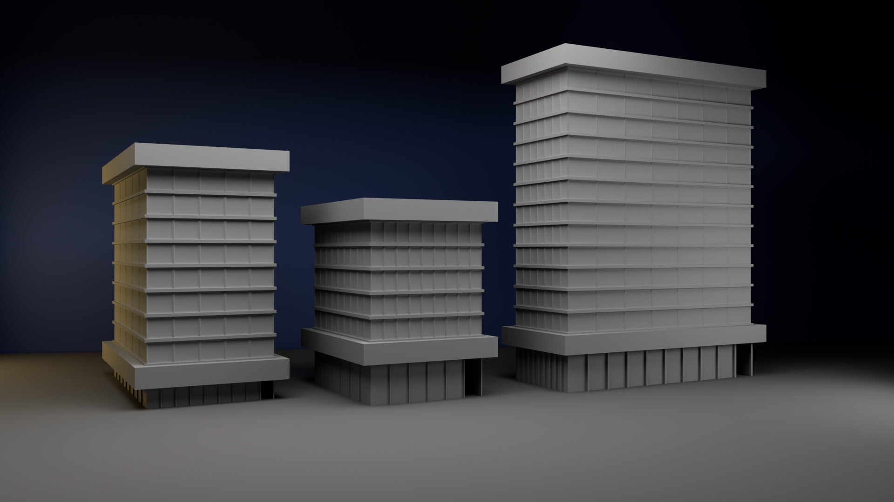
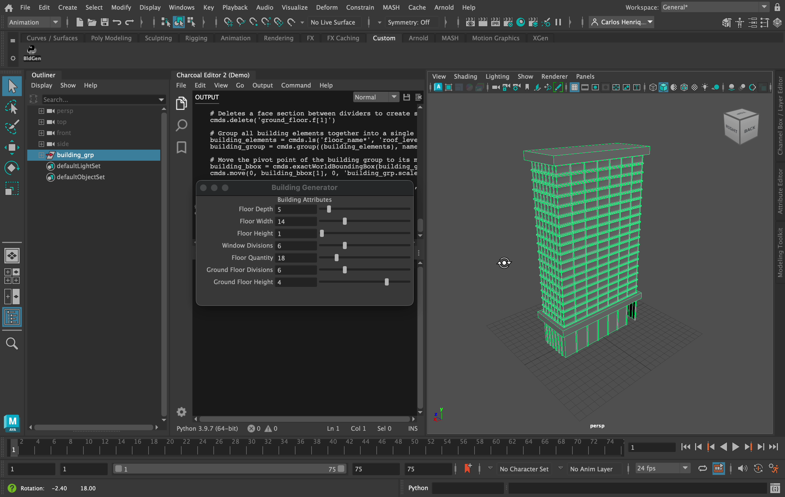

 # Maya Building Generator

## Introduction

This Python script generates customizable buildings in Autodesk Maya using a GUI for user-friendly adjustments. It allows users to specify the following building attributes:

- **Floor Depth:** Defines the depth of each floor of the building.
- **Floor Width:** Sets the width of each floor.
- **Floor Height:** Specifies the height of each floor.
- **Window Divisions:** Determines the number of windows of each floor.
- **Floor Quantity:** Sets the number of floors in the building.
- **Ground Floor Divisions:** Specifies the number of divisions for the ground floor.
- **Ground Floor Height:** Sets the height of the ground floor.

I developed this project to apply automation principles, using Python, to 3D modeling. Firstly, I followed an excellent tutorial by MH Tutorials ([Link](https://youtu.be/BOmNx2n0j_k)) for the modeling aspect. And throughout the modeling process, I automated each step through scripting.

The key aspect of developing this script was to create code that offers flexibility in customizing attributes while maintaining accurate proportions. As a result, I was able to create a basic blueprint that can be used to generate different types of objects, while preserving a coherent design.

## Dependencies

- **Autodesk Maya**: The script requires Autodesk Maya with Python support. The project was developed using Maya 2023, but it should be compatible with other versions that support Python scripting.
- **Maya API**: The script utilizes the Maya API to interact with Maya’s functionalities.
- **`maya.cmds` Module**: The script uses the `maya.cmds` module, which is part of Maya’s Python API.

## Installation

No additional dependencies are required besides Autodesk Maya with Python support.

## How To Use

To get started with the building generator script, follow these steps:

1. Open Autodesk Maya.
2. Go to the Script Editor (under Windows > General Editors > Script Editor).
3. Run the building_generator.py Python script by navigating to File > Open Script. Execute the code.
4. Use the GUI to adjust building parameters.
5. The building model will update in real-time as you adjust the sliders.

## License

This project is licensed under the MIT License - see the [LICENSE](LICENSE) file for details.

## Screenshots

*Image 01: three different buildings modeled with the script.*

*Image 02: The script running with its GUI in Autodesk Maya.*
